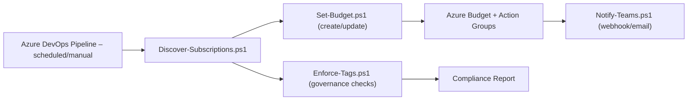

# Azure Budget Governance at Scale 🚦💸


> **Redaction statement:** This repository intentionally contains **no** live secrets, IP addresses, tenant names/IDs, or customer identifiers. Sensitive values are represented with placeholders like `{{SUBSCRIPTION_ID}}`, `{{TEAMS_WEBHOOK_URL}}`, and `{{RG_NAME}}`.

---

## 👋 Overview

Production-ready templates and docs to **govern Azure spend** across many subscriptions by automating **Budgets, Alerts, and Notifications** using **PowerShell** and (optionally) **Azure DevOps**. Built for estates with 10s–100s of subscriptions, prioritising **repeatability**, **guardrails**, and **zero manual drift**.

### 🎯 Goals

- Ensure each subscription has a **budget** with **threshold alerts** (email/Teams).
- Enforce **tag standards** used for cost reporting (e.g., `CostCenter`, `Owner`, `Environment`).
- Provide **idempotent scripts** and a minimal **CI pipeline pattern**.
- Ship **Ops-grade docs**: runbook, cutover checklist, rollback, and security notes.

---

## 🧱 Repository structure

```
.
├─ README.md
├─ RUNBOOK.md
├─ .gitignore
├─ docs/
│  ├─ OVERVIEW.md
│  ├─ ARCHITECTURE.md
│  ├─ CUTOVER_CHECKLIST.md
│  ├─ ROLLBACK.md
│  └─ SECURITY.md
└─ scripts/
   ├─ Discover-Subscriptions.ps1
   ├─ Set-Budget.ps1
   ├─ Enforce-Tags.ps1
   ├─ Notify-Teams.ps1
   └─ json/
      └─ budget-template.json
```

Shortcut links:  
- [`docs/OVERVIEW.md`](docs/OVERVIEW.md) • [`docs/ARCHITECTURE.md`](docs/ARCHITECTURE.md) • [`docs/CUTOVER_CHECKLIST.md`](docs/CUTOVER_CHECKLIST.md) • [`docs/ROLLBACK.md`](docs/ROLLBACK.md) • [`docs/SECURITY.md`](docs/SECURITY.md)

---

## 🗺️ Lifecycle (SDLC/Operations)

1) **Discover** — enumerate subscriptions & required tags.  
2) **Plan** — agree budget amounts & thresholds per scope.  
3) **Build** — wire DevOps pipeline and parameterise scripts.  
4) **Test** — run in pilot subs; verify alerts and RBAC.  
5) **Cutover** — apply to all prod subscriptions in waves.  
6) **Operate** — monthly review, drift checks, rotation.  
7) **Optimise** — tune thresholds & automate recommendations.  
8) **Decommission** — archive configs when subs are closed.

---

## 🧩 High-level flow (Mermaid)



---

## 🚀 Quick start

1. **Install prerequisites** (Cloud Shell or workstation): `Az.Accounts`, `Az.Billing`, `Az.Resources`.  
2. **Authenticate:**  
   ```powershell
   Connect-AzAccount
   ```
   > In CI use a service connection / service principal with least privilege.
3. **Adjust settings:** edit `scripts/json/budget-template.json` (amount, thresholds, emails).
4. **Discover subscriptions:**
   ```powershell
   ./scripts/Discover-Subscriptions.ps1 -ManagementGroupId "{{MG_ID}}"
   ```
   Outputs `./output/subscriptions.csv`.
5. **Apply budgets:**
   ```powershell
   ./scripts/Set-Budget.ps1 -InputCsv ./output/subscriptions.csv `
     -Amount 5000 -TimeGrain Monthly -Thresholds 50,75,90,100
   ```
6. **(Optional) Notify Teams after rollout:**
   ```powershell
   ./scripts/Notify-Teams.ps1 -WebhookUrl "{{TEAMS_WEBHOOK_URL}}" `
     -Title "Budget rollout complete" -Message "Budgets created/updated."
   ```

---

## 🔐 Security & Redaction

- **No** secrets, IPs, tenant IDs, or customer names in this repo.  
- Use CI variables / Key Vault for: webhook URLs, emails, IDs.  
- Automation identity roles (minimum):  
  - `Reader` + `Cost Management Contributor` (subscription scope).  
  - `Tag Contributor` only if using tag fix-ups.

See [`docs/SECURITY.md`](docs/SECURITY.md) for details.

---

## 🛠️ Operations

- Day-to-day procedures: [`RUNBOOK.md`](RUNBOOK.md)  
- Cutover steps/waves: [`docs/CUTOVER_CHECKLIST.md`](docs/CUTOVER_CHECKLIST.md)  
- Rollback strategy: [`docs/ROLLBACK.md`](docs/ROLLBACK.md)

---

## ⚠️ Notes

- Scripts are **idempotent**: safe to re-run; they create or update as needed.  
- Threshold “actions” are modelled; wire your action groups or Teams/email in CI.  
- Replace all placeholders `{{...}}` before production use.

---

## 📜 License

MIT — shared as a redacted template derived from real enterprise work.
